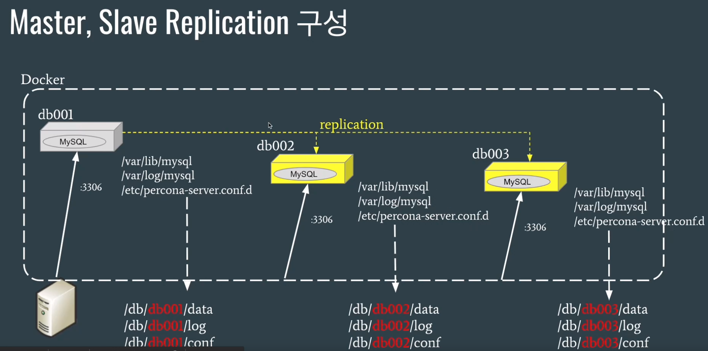

## chap2 Master-Slave Replication

### 구성도



### 볼륨 마운트 준비

```shell
    mkdir -p db002/data db003/data
    chmod 777 db002 db002/data
    chmod 777 db003 db003/data

    mkdir -p db002/log db002/conf
    mkdir -p db003/log db003/conf
    chmod 777 db002/log db002/conf
    chmod 777 db003/log db002/conf

    # 설정 파일 입력
    vim db002/conf/my.cnf 
    vim db003/conf/my.cnf
    
    chmod 644 db002/conf/my.cnf
    chmod 644 db003/conf/my.cnf
```

```
[mysqld]
log_bin                     = mysql-bin
binlog_format               = ROW
gtid_mode                   = ON
enforce-gtid-consistency    = true
# 이부분
server-id                   = 300
log_slave_updates
datadir                     = /var/lib/mysql
socket                      = /var/lib/mysql/mysql.sock
# slave 이기 때문에 read only 설정이 되어있는것을 확인하자
read_only

# Disabling symbolic-links is recommended to prevent assorted security risks
symbolic-links              = 0

log-error                   = /var/log/mysql/mysqld.log
pid-file                    = /var/run/mysqld/mysqld.pid

# 이부분
report_host                 = db003

[mysqld_safe]
pid-file                    = /var/run/mysqld/mysqld.pid
socket                      = /var/lib/mysql/mysql.sock
nice                        = 0
```

> my.cnf 설정시 위의 설정 파일 처럼 
>
> Slave이기 때문에 read_only 설정이 필요하다
>
> 또한 server-id와 report_host를 유니크하게 설정해주자

### 도커 실행

```shell
    docker run -it --name db002 -h db002 -p 3308:3306 \
    -v db002/data:/var/lib/mysql \
    -v db002/log:/var/log/mysql \
    -v db002/conf:/etc/percona-server.conf.d \
    -e MYSQL_ROOT_PASSWORD="root" -d percona:5.7.30

    docker run -it --name db003 -h db003 -p 3309:3306 \
    -v db003/data:/var/lib/mysql \
    -v db003/log:/var/log/mysql \
    -v db003/conf:/etc/percona-server.conf.d \
    -e MYSQL_ROOT_PASSWORD="root" -d percona:5.7.30
```

### replica user

```shell
    docker exec -it -uroot db001 /bin/bash
    mysql -u root -p

    mysql> CREATE USER 'repl'@'%' IDENTIFIED BY 'repl';
    mysql> GRANT REPLICATION SLAVE ON *.* TO 'repl'@'%';

    ifconfig
    # Master의 ip를 확인 한다.
    # 172.17.0.2
```

```shell
    docker exec -it -uroot db002 /bin/bash
    mysql -u root -p

    mysql> reset master;
    mysql> CHANGE MASTER TO MASTER_HOST='172.17.0.2', \
    MASTER_USER='repl', MASTER_PASSWORD='repl', \
    MASTER_AUTO_POSITION=1;

    mysql> start slave;

    mysql> show slave status\G
```

> 작업하는 도중 이미 테스트 데이터베이스와 테이블 그리고 데이터를 입력하고
>
> 이후에 위의 레플리케이션 설정을 하였더니 에러가 발생하였다.
>
> 기본적으로 기존 데이터는 mysqldump -uroot -p --all-databases > dump.sql
>
> 와 같이 덤프를 뜬 뒤 mysql -u root -p --force < dump.sql
>
> 기존 데이터를 입력하고 슬레이브 설정을 완료 하자


---


### Bridge Network를 이용한 Replication구성

> Container는 언제든지 재 시작될 수 있고 Container가 재 시작되면 해당 Container의 IP가 변경될 수 있다.
> MySQL의 Replication 설정이나 HA 설정에 IP를 사용하게 되면 Container가 재 시작될 경우 변경된 IP 때문에 Replication이 깨질 수 있다.
> 이러한 문제를 방지하기 위해 Bridge Network를 구성하고 net alias를 사용하여 IP 변경에도 문제가 발생하지 않도록 할 수 있다.


Bridge Network를 생성한다.

```shell
    docker network ls 
NETWORK ID     NAME              DRIVER    SCOPE
18157099f1bd   bridge            bridge    local
86800c0e54c9   host              host      local
1f32d32265d8   none              null      local

    docker network create --driver bridge mybridge
```

기존의 Container를 제거하고 Network를 적용하여 다시 띄운다.

```shell
    docker stop db001 db002 db003
    docker rm db001 db002 db003

    rm db001/log/* db001/data/*
    rm db002/log/* db002/data/*
    rm db003/log/* db003/data/*
```

Bridge Network를 이용해서 Container 생성

```shell
    docker run -it --name db001 -h db001 -p 3307:3306 \
    --net mybridge --net-alias=db001 \
    -v db001/data:/var/lib/mysql \
    -v db001/log:/var/log/mysql \
    -v db001/conf:/etc/percona-server.conf.d \
    -e MYSQL_ROOT_PASSWORD="root" -d percona:5.7.30
```

Alias명으로 각 Container에 접근이 가능한지 확인해보자

```shell
    ping db001
    ping db002
    ping db003
```

이후 위의 Replication 설정과 동일하게 작업한다.
이때 MASTER_HOST='db001' 와 같이 alias로 host를 설정하자 

```shell
    docker exec -it -uroot db002 /bin/bash
    mysql -u root -p

    mysql> reset master;
    mysql> CHANGE MASTER TO MASTER_HOST='db001', \
    MASTER_USER='repl', MASTER_PASSWORD='repl', \
    MASTER_AUTO_POSITION=1;

    mysql> start slave;

    mysql> show slave status\G
```

